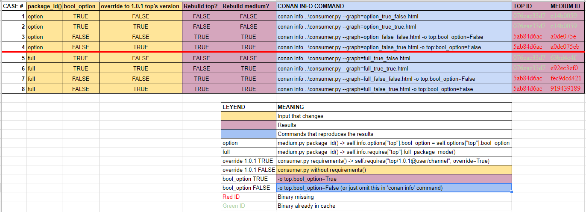

# Dependency graph description

`consumer` depends on `medium` and `medium` depends on `top`

`consumer` --> `medium` --> `top`

Let's create the test scenario:

```
$ conan create top.py top/1.0.0@user/channel
...
top/1.0.0@user/channel: Package '076eae33d74a6adf7c1592cbc0c7c85f6dc5902b' created

$ conan create medium.py medium/1.0.0@user/channel
...
medium/1.0.0@user/channel: Package 'c14b0059b326127e444d25b301f43a73effc4dda' created
```

# Conditions

`medium` package is affected if `bool_option` option in `top` package changes and follows semantic versioning, so we define its ID as:

```
    def package_id(self):
        self.info.options["top"].bool_option = self.options["top"].bool_option
```

# Test case confirmation

Let's calculate the graph for our `consumer` with default options:

```
$ conan info ..\consumer.py
PROJECT
    ID: bca145eaeb0a76af638138f7ee2290ae3d0eba64
    BuildID: None
    Requires:
        medium/1.0.0@user/channel
medium/1.0.0@user/channel
    ID: c14b0059b326127e444d25b301f43a73effc4dda
    BuildID: None
    Remote: None
    Recipe: Cache
    Binary: Cache
    Binary remote: None
    Creation date: 2018-11-21 17:47:47
    Required by:
        PROJECT
    Requires:
        top/1.0.0@user/channel
top/1.0.0@user/channel
    ID: 076eae33d74a6adf7c1592cbc0c7c85f6dc5902b
    BuildID: None
    Remote: None
    Recipe: Cache
    Binary: Cache
    Binary remote: None
    Creation date: 2018-11-21 17:47:35
    Required by:
        medium/1.0.0@user/channel
```

If you check the package IDs listed in the info output, those are the ones we created originally.

Now, let's suppose our `consumer` requires `top` to have option `bool_option` set to `False` (different from the value defaulted in `top`
recipe):

```
$ conan info ..\consumer.py -o top:bool_option=False
PROJECT
    ID: bca145eaeb0a76af638138f7ee2290ae3d0eba64
    BuildID: None
    Requires:
        medium/1.0.0@user/channel
medium/1.0.0@user/channel
    ID: a0de075eb939c5f3d7ef1781ccacdeb3a71ab101
    BuildID: None
    Remote: None
    Recipe: Cache
    Binary: Missing
    Binary remote: None
    Creation date: 2018-11-21 17:47:47
    Required by:
        PROJECT
    Requires:
        top/1.0.0@user/channel
top/1.0.0@user/channel
    ID: 5ab84d6acfe1f23c4fae0ab88f26e3a396351ac9
    BuildID: None
    Remote: None
    Recipe: Cache
    Binary: Missing
    Binary remote: None
    Creation date: 2018-11-21 17:47:35
    Required by:
        medium/1.0.0@user/channel
```

Finally, if you check the package IDs listed in the info output, those are **different** from the ones we created originally, so we will
need to rebuild `top` and `medium`.

# Why I think this is right?

Removing the `package_id()` method in `medium` will result on having to rebuild package `top` and not `medium` which is fine (is the
expected behavior) but is not the condition we set previously (if option changes in `top`, `medium`'s package ID is affected).

# Why is this different from `full_package_mode()`?

Having a `medium`'s `package_id()` like this will also achieve the desired behavior:

```
    def package_id(self):
        self.info.requires["top"].full_package_mode()
```

However this will also require a rebuild of `medium` if there is a minimum change in `top`. For example, if version of `top` is bumped from
1.0.0 to 1.0.1 this will require `medium` to be rebuilt, which is **NOT** the desired behavior described in our condition.

Let's make the test:

We are going to use the **full package mode**. Edit *medium.py* and replace the original `package_id()` with the following one
(indicated above):

```
from conans import ConanFile


class Medium(ConanFile):
    requires = "top/1.0.0@user/channel"

    def package_id(self):
        self.info.requires["top"].full_package_mode()
```

We create the packages:

```
$ conan create top.py top/1.0.0@user/channel
...
top/1.0.0@user/channel: Package '076eae33d74a6adf7c1592cbc0c7c85f6dc5902b' created

$ conan create top.py top/1.0.1@user/channel
...
top/1.0.0@user/channel: Package '076eae33d74a6adf7c1592cbc0c7c85f6dc5902b' created

$ conan create medium.py medium/1.0.0@user/channel
...
medium/1.0.0@user/channel: Package '63bd4c4f4165618d5ade2b94aa73c465c9c00c43' created
```

If we inspect the output of the `conan info` command, we see that the package IDs required from `medium` and `top` are missing, so we achieved the behavior set in our condition:

```
$ conan info consumer.py -o top:bool_option=False
PROJECT
    ID: bca145eaeb0a76af638138f7ee2290ae3d0eba64
    BuildID: None
    Requires:
        medium/1.0.0@user/channel
medium/1.0.0@user/channel
    ID: fec9dcd421d7ba7f06ef57abd6f7ac2d4fe5fc04
    BuildID: None
    Remote: None
    Recipe: Cache
    Binary: Missing
    Binary remote: None
    Creation date: 2018-11-22 09:31:56
    Required by:
        PROJECT
    Requires:
        top/1.0.0@user/channel
top/1.0.0@user/channel
    ID: 5ab84d6acfe1f23c4fae0ab88f26e3a396351ac9
    BuildID: None
    Remote: None
    Recipe: Cache
    Binary: Missing
    Binary remote: None
    Creation date: 2018-11-22 09:19:24
    Required by:
        medium/1.0.0@user/channel
```

And now let's override the `top` requirement in *consumer.py* to require the `top/1.0.1` version like this:

```
from conans import ConanFile


class Consumer(ConanFile):
    requires = "medium/1.0.0@user/channel"

    def requirements(self):
        self.requires("top/1.0.1@user/channel", override=True)
```

We also create the new `top/1.0.1` version:

```
$ conan create top.py top/1.0.1@user/channel
...
top/1.0.0@user/channel: Package '076eae33d74a6adf7c1592cbc0c7c85f6dc5902b' created
```

If we inspect the results of `conan info` command we see that the `medium` binary is also missing, and this is **NOT** the behavior we
wanted:

```
$ conan info consumer.py -o top:bool_option=False
medium/1.0.0@user/channel requirement top/1.0.0@user/channel overridden by your conanfile to top/1.0.1@user/channel
PROJECT
    ID: bca145eaeb0a76af638138f7ee2290ae3d0eba64
    BuildID: None
    Requires:
        medium/1.0.0@user/channel
medium/1.0.0@user/channel
    ID: 91943918905df4184c15d6a3594e79e60b9557a1
    BuildID: None
    Remote: None
    Recipe: Cache
    Binary: Missing
    Binary remote: None
    Creation date: 2018-11-22 09:31:56
    Required by:
        PROJECT
    Requires:
        top/1.0.1@user/channel
top/1.0.1@user/channel
    ID: 5ab84d6acfe1f23c4fae0ab88f26e3a396351ac9
    BuildID: None
    Remote: None
    Recipe: Cache
    Binary: Missing
    Binary remote: None
    Creation date: 2018-11-22 09:19:37
    Required by:
        medium/1.0.0@user/channel
```

# Conclusion: Why option changes in upstream dependencies does not affect my package ID by default?

Options from requirements are cleaned by default in package ID calculation: ``clean_indirect()``:
https://github.com/conan-io/conan/blob/c939d0ca795ac284ede35b32fb7435e235912c30/conans/model/info.py#L229

This is done because recipe packages with requirements should be responsible for defining their compatibility.

Following the example
presented, let's suppose top's `bool_option` is a `shared` one. If `medium` is another library and requires `top` with static linking the
code of `top` will be embedded into `medium`'s binary. In that case the `shared` flag of should affect the package ID of `medium` if the
flag is changed downstream, so I will have to declare in *medium.py*:

```
    def package_id(self):
        self.info.options["top"].bool_option = self.options["top"].bool_option
```

However, let's suppose `medium` is a header only library and it's code does NOT change regardless of the any of top's options. In that case
the `package_id()` presented above is not valid, so **we cannot generalize that options of requirements ALWAYS changes the pacakge ID**.

# Tests done

Here it is the table with the combinations done for this tests and the commands run to check the conditions and generate the HTML graph
files:



Commands:

- Create all needed packages:

  ```
  $ conan create top.py top/1.0.0@user/channel
  $ conan create top.py top/1.0.1@user/channel
  $ conan create top.py top/1.0.0@user/channel
  ```

- Run the info commands:

  ```
  $ cd info

  $ conan info ..\consumer.py --graph=option_true_false.html

  # Edit consumer.py to override top version to 1.0.1
  $ conan info ..\consumer.py --graph=option_true_true.html

  # Edit consumer.py to NOT override top version
  $ conan info ..\consumer.py --graph=option_false_false.html -o top:bool_option=False

  # Edit consumer.py to override top version to 1.0.1
  $ conan info ..\consumer.py --graph=option_false_true.html -o top:bool_option=False

  # Edit package_id() of medium.py to full_package_mode() and create a new medium package
  $ conan create medium.py medium/1.0.0@user/channel

  # Edit consumer.py to NOT override top version
  $ conan info ..\consumer.py --graph=full_true_false.html

  # Edit consumer.py to override top version to 1.0.1
  $ conan info ..\consumer.py --graph=full_true_true.html

  # Edit consumer.py to NOT override top version
  $ conan info ..\consumer.py --graph=full_false_false.html -o top:bool_option=False

  # Edit consumer.py to override top version to 1.0.1
  $ conan info ..\consumer.py --graph=full_false_true.html -o top:bool_option=False
  ```
